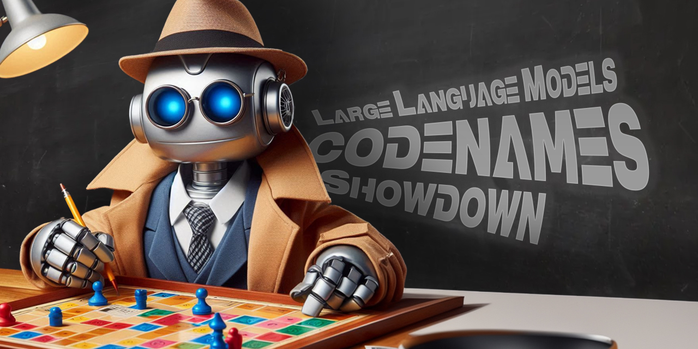

# 🧠🤖 LLM Codenames Showdown

Welcome to the **LLM Codenames Showdown**! This project brings together some of the most advanced Large Language Models (LLMs) to form AI teams and compete in the popular game Codenames.

## Overview

Codenames is a word-based party game where players give one-word clues to help their team guess specific words from a grid, avoiding the opposing team's words and a deadly assassin word. In this project, we simulate this game using LLMs like GPT-4, LLaMa, and other cutting-edge models to evaluate their performance, strategic thinking, and language understanding.

## Objectives

- **Build AI Teams**: Develop teams of AI agents using various LLMs.
- **Performance Evaluation**: Analyze and compare how well these models perform in generating and interpreting clues.
- **Interactive Play**: Engage these AI teams in head-to-head Codenames matches to observe their gameplay strategies.
- **Build a competitive team**: Challenge the best AI team with a human teams.
